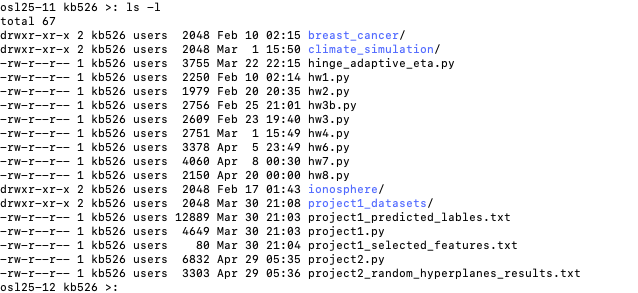
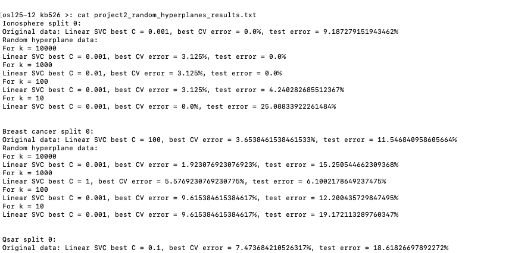
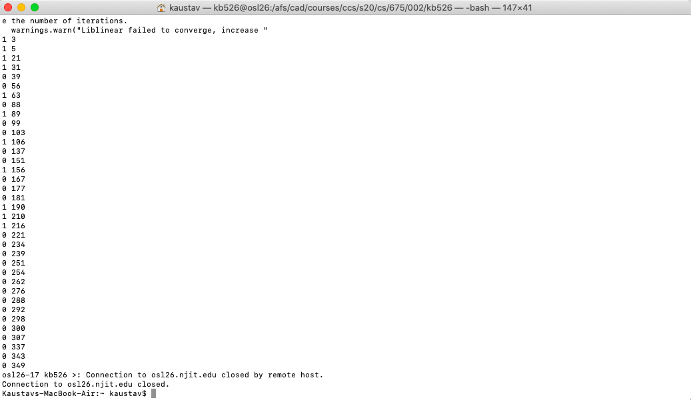

# Hyperplanes

## Objective
In this project we will experiment with random hyperplanes 
for classification. Your program will take a dataset as input and
produce new features following the procedure below. The input is in
the same format as for previous assignments.

Input data matrix X: n rows, m columns
Input training labels Y
Input value of k

For i = 0 to k do:

	a. Create random vector w where each wj is uniformly sampled between -1 and 1.
	
	b. Let xj be our training data points. Determine the largest and smallest wTxj
	across all xj. Select w0 randomly between [smallest wTxj, largest wTxj].

	c. Project training data X (each row is datapoint xj) onto w. 
	Let projection vector zi be Xw + w0 (here X has dimensions n by m and w is m by 1).
	Append (1+sign(zi))/2 as new column to the right end of Z. Remember that zi is
	a vector and so (1+sign(zi))/2 is 0 if the sign is -1 and 1 otherwise.
	
	d. Project test data X' (each row is datapoint xj) onto w. 
	Let projection vector z'i be X'w + w0. Append (1+sign(z'i))/2 as new column to 
	the right end of Z'. We create the test data in exactly the same way as we do
	the training except that we do it on X' the test data instead of X the training data.
	
1. Run linear SVM on Z and predict on Z'
2. Do values of k=10, 100, 1000, and 10000.
3. How does the error compare to liblinear on original data X and X' for each k?

Submit a document containing the error of linear SVM (cross-validated C) on the 
first split of each of the six datasets on the course website. Do this on the original 
data representation and the new representation for all values of k.

Submit your program that creates features and run LinearSVC (in Python scikit)
on the new training data and predicts on the new test data. In LinearSVC set the
max_iter parameter to 10000 so that we do a deep search.

The input to your program is the same as for the assignments: the full dataset
plus the train labels and in addition a value k for the number of new features.
The output of your program should be the prediction of the test data with
cross-validated svm (for example LinearSVC) on the new data representation.

Directories: /afs/cad/courses/ccs/s20/cs/675/002/<ucid>.
For example if your ucid is abc12 then copy your programs into
/afs/cad/courses/ccs/s20/cs/675/002/abc12.

Your completed program is due before 1pm 04/29/20

## How to run this program
```
python3 project2.py breast_cancer/breast_cancer.data breast_cancer/breast_cancer.trainlabels.0 10 >test_breast_cancer.csv
```

## Proof of Submission


